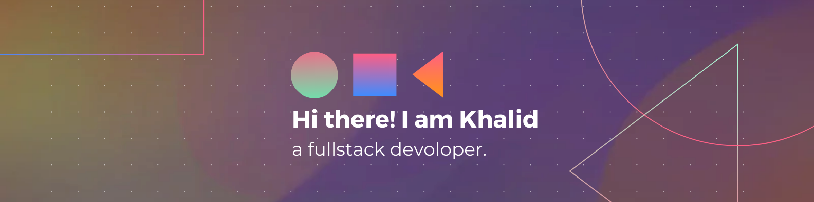

<!--  -->

## 💫 About Me:

- 👾 I am a Software engineering student at ALX / computer science student at UAE.
- 🌱 Currently Learning ***Next js*** by building a [**Pomodoro**](https://github.com/sanotogii/pomodoro).
- 📫 Email: khalidlazrag.contact@gmail.com

🔗 [LinkedIn](https://www.linkedin.com/in/khalid-lazrag-91305423a/) | [X](https://x.com/khalid__py)

## 💻 Tech Stack:
                              

<!-- <h3 id="github-stats" align="center">📊 GitHub Stats:</h3> -->

  

<!-- 

  

  

 -->

 
 
 
 
 
 
 
 
 
 
 
 
 
 
 
 
 
 
 
 
 
 
 
 
 
 
 
 
 
 
 
 
 
 
 
 
 
 
 
 
 
 
 
 
 
 
 
 
 
 
 
 
 
 
 
 
 
 
 
 
 
 
 
 
 
 
 
 
 
 
 
 
 
 
 
 
 
 
 
 
 
 
 
 
 
 
 
 
 
 
 
 
 
 
 
 
 
 
 
 
 
 
 
 
 
 
 
 
 
 
 
 
 
 
 
 
 
 
 
 
 
 
 
 
 
 
 
 
 
 
 
 
 
 
 
 
 
 
 
 
 
 
 
 
 
 
 
 
 
 
 
